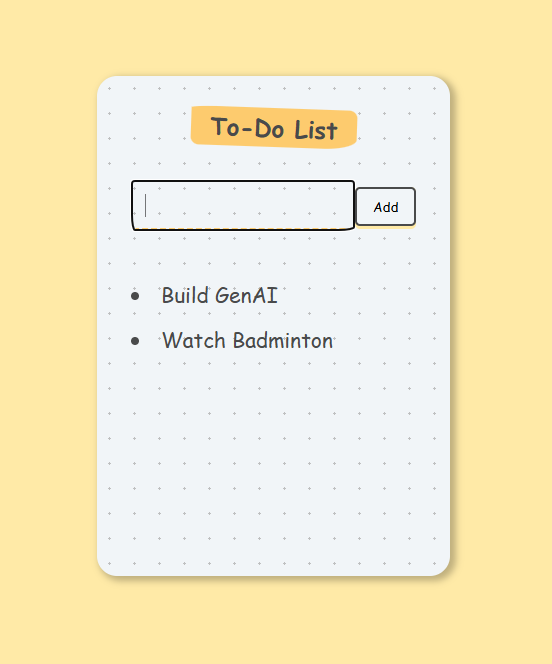

# Todo App

A simple Todo App built using React JS. This application allows users to add items to a todo list and remove items by clicking on them.



## Features

- Add items to the todo list.
- Click on items to remove them from the list.

## Prerequisites

- Node.js and npm installed on your machine. You can download them from [here](https://nodejs.org/).

## Installation

1. **Clone the repository:**

   ```bash
   https://github.com/kganeshv12/Todo_App_React.git
   cd Todo_App_React
   ```
2. **Install dependencies:**

   ```bash
   Copy code
   npm install
   ```
   Run the app:
   
   ```bash
   Copy code
   npm start
   ```
   The app will run in development mode. Open http://localhost:3000 to view it in the browser.

  ## Usage
  ### Add a todo item:
  
  Enter the item in the input field and press "Enter" or click the "Add" button.
  
  ### Remove a todo item:
  
  Click on the item you wish to remove from the list.
